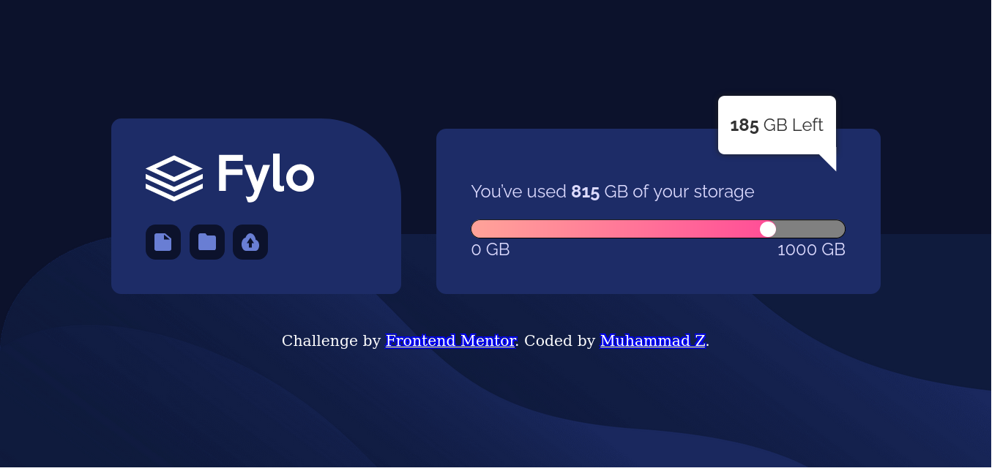

# Frontend Mentor - Fylo data storage component solution

This is a solution to the [Fylo data storage component challenge on Frontend Mentor](https://www.frontendmentor.io/challenges/fylo-data-storage-component-1dZPRbV5n). Frontend Mentor challenges help you improve your coding skills by building realistic projects. 

## Overview

### The challenge

Users should be able to:

- View the optimal layout for the site depending on their device's screen size

### Screenshot

### Links

- Solution URL: [Add solution URL here](https://www.frontendmentor.io/solutions/fylo-storage-component-using-vanilla-css-flexbox-after-JSvaPdC7CM)
- Live Site URL: [GitHub Pages](https://muhammad-z.github.io/frontend-mentor-challenges/fylo-data-storage-component-main)

## My process

### Built with

- Semantic HTML5 markup
- CSS custom properties
- Flexbox

**Note: These are just examples. Delete this note and replace the list above with your own choices**

### What I learned

I made use of ::after sub class and learned more about absolute, relative positions
How to make an arrow using borders

## Author

- Website - [Add your name here](https://muhammad-z.github.io/)
- Frontend Mentor - [@yourusername](https://www.frontendmentor.io/profile/Muhammad-Z)

