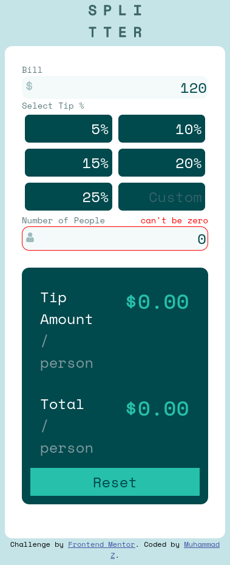
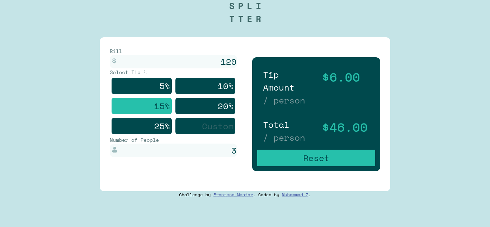

# Frontend Mentor - Tip calculator app solution

This is a solution to the [Tip calculator app challenge on Frontend Mentor](https://www.frontendmentor.io/challenges/tip-calculator-app-ugJNGbJUX). Frontend Mentor challenges help you improve your coding skills by building realistic projects.

## Overview

### The challenge

Users should be able to:

- View the optimal layout for the app depending on their device's screen size
- See hover states for all interactive elements on the page
- Calculate the correct tip and total cost of the bill per person

### Screenshot

### Links

- Solution URL: [Frontend Mentor](https://www.frontendmentor.io/solutions/tip-calculator-app-mobile-first-vanilla-htmlcssjs-kqiQ-5P5sA)
- Live Site URL: [GitHub Pages](https://muhammad-z.github.io/frontend-mentor-challenges/tip-calculator-app-main/)

## My process

### Built with

- Semantic HTML5 markup
- CSS custom properties
- Flexbox
- Mobile-first workflow

**Note: These are just examples. Delete this note and replace the list above with your own choices**

### What I learned

Well, I learned plenty of small useful tips.. some of them are:
- inline elements like input does not accept ::before or ::after style
- practise event delegation
- controlled inputs
- button type inputs

## Author

- Website - [GitHub Pages](https://muhammad-z.github.io/)
- Frontend Mentor - [@Muhammad-Z](https://www.frontendmentor.io/profile/Muhammad-Z)
